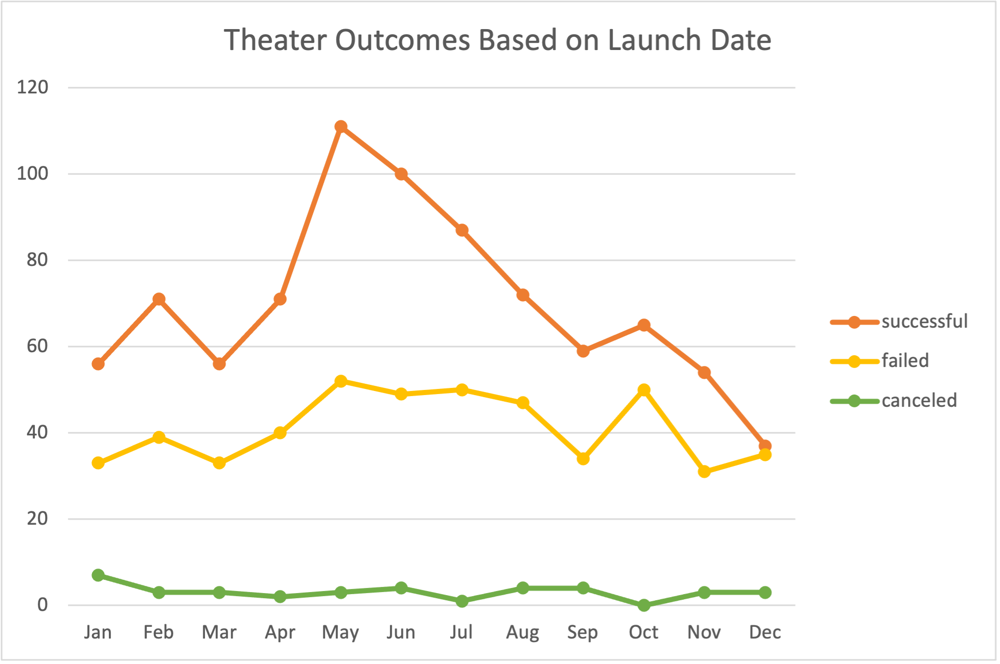
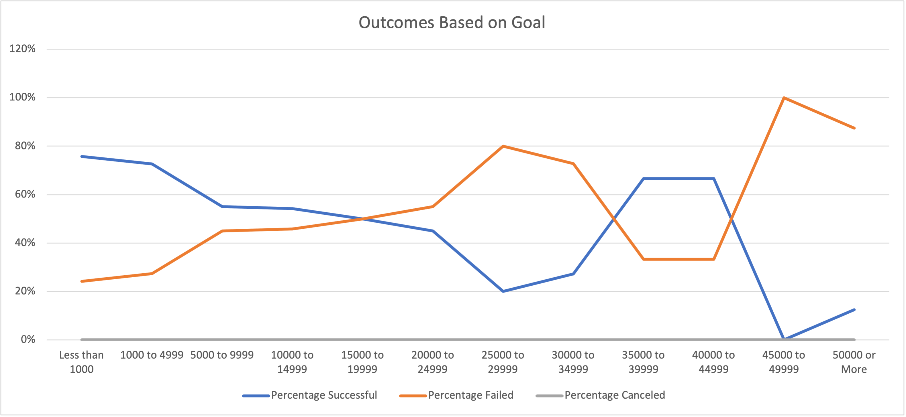

# Kickstarting with Excel

## Overview of Project
Louise wants to know how different campaigns fared in relation to their launch dates and funding goals, after her play <i>Fever</i> came close to its fundraising goal in a short amount of time. The campaign outcomes have been visualized based on launched dates and funding goals, and below is the analysis of the project. 

### Purpose

## Analysis and Challenges

### Analysis of Outcomes Based on Launch Date

### Analysis of Outcomes Based on Goals

### Challenges and Difficulties Encountered

## Results

- What are two conclusions you can draw about the Outcomes based on Launch Date?
  -The month of May was the most successful launch date for theater.
  -There were more successful launches than failed or canceled launches for theater. 

- What can you conclude about the Outcomes based on Goals?
  -There was a higher percentage of successful play launches than failed play launches. 
  
- What are some limitations of this dataset?
  -We aren't able to track the success rates of the plays over time, if they stayed open after they launched, or if they closed after a two week run. We    also aren't able to verify if the same commitments went into each campaign that could have attributed to their successful, failed, or canceled launched.
  
- What are some other possible tables and/or graphs that we could create?
